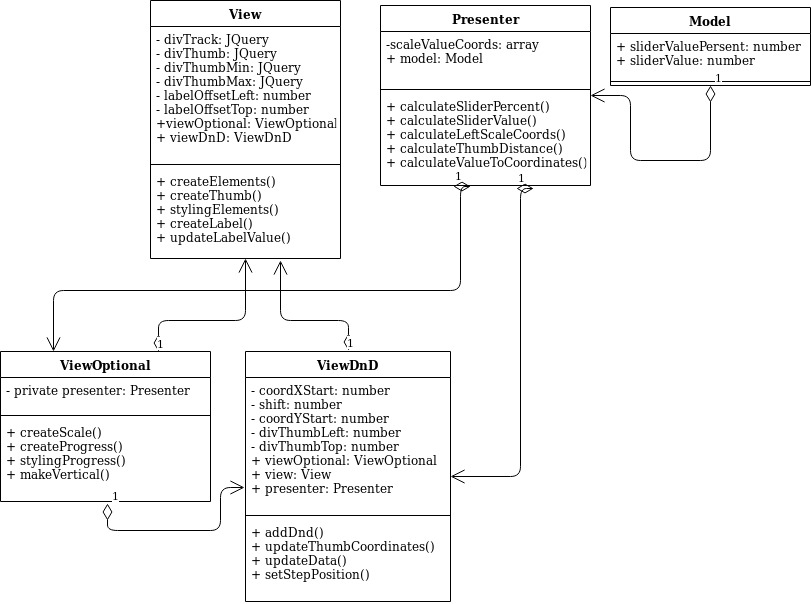

# Slider: Jquery plugin

[Github pages](https://dindeni.github.io/slider)

Диаграмма плагина:

Описание:  

В классе View создаются базовые графические элементы и элементы управления,
   создаются и используются экземпляры вспомогательных классов view, получаются данные
    настроек из Jquery обертки slider.ts. ViewOptional добавляет дополнительные
     возможности на основе координат полученных из класса Presenter. ViewDnD
      отрисовывает смещение ползунка на основе данных полученных из Presenter. 
      Все слои view взаимодействуют между собой и могут получать данные,
       инициализировать различные расчёты из Presenter, но изолированы от Model.  

Класс Presenter производит расчёты инициализируемые View, на основе которых
 отрисовывается визуальная часть, передаёт полученные данные в Model.  

Класс Model получает данные значений слайдера от Presenter, слой изолирован от View.

Все слои обёрнуты в Jquery обёртку, которая инициализирует плагин, и в нее передаются настройки. 