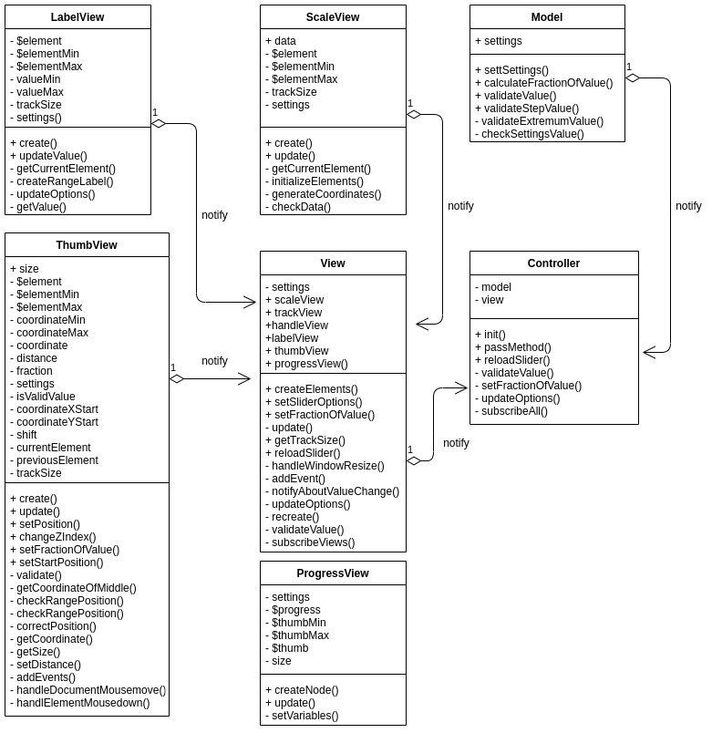

# Slider: Jquery plugin

[Github pages](https://dindeni.github.io/slider)

#### Разворачивание и запуск проекта: 

`npm install`

`npm run develop`

#### Запуск тестов: 

`karma start`

`npm test`

#### Создание production версии проекта:

`npm run build`

Диаграмма плагина:

Описание:  

В классе View создаются базовые графические элементы и элементы управления,
создаются и используются экземпляры вспомогательных классов view, получаются данные
настроек из Jquery обертки sliderInit.ts. ViewOptional добавляет дополнительные
возможности на основе координат. ViewHandle занимается обработка событий.
ViewUpdating обновляет состояние визуальных елементов слайдера.
ViewOnTrack занимается отрисовкой событий на треке слайдера. Все слои view оповещают Controller об
изменениях во views.

Класс Controller являет связующим слоем между view и моделью, получая уведомления из view,
обновляет модель получая из нее требуемые данные и передает их во view.  

Класс Model реализует бизнес-логику приложения. Он связан с Controller, получая оттуда
уведомления об изменениях.  вки

Все слои обёрнуты в Jquery обёртку, которая инициализирует плагин, и в нее передаются настройки. 
