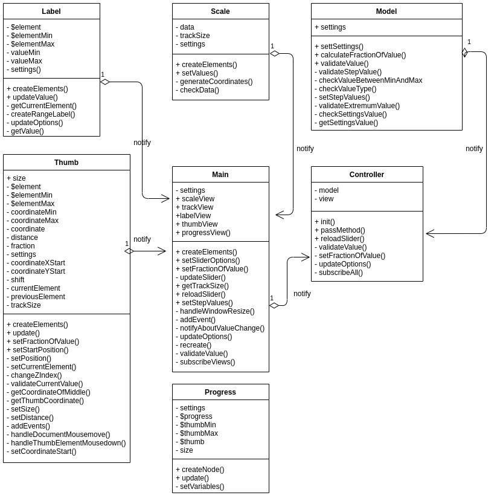

# Slider: Jquery plugin

[Github pages](https://dindeni.github.io/slider)

#### Разворачивание и запуск проекта:

  `npm install`

  `npm run develop`

#### Создание production версии проекта:

  `npm run build`

#### Разворачивание проекта на github pages:

  `npm run deploy`

#### Запуск тестов:

  `karma start`

  `npm test`

Диаграмма плагина:

  

Описание:  

Класс View создает экземпляры своих дочерних классов и вызывает нужные методы
для отрисовки и обновления элементов слайдера, посылает уведомления в Controller для
обновления состояние плагина.
HandleView осуществляет добавление и обработку событий(event listeners), обновляет
элементы плагина на основе данных из родительского view.
LabelView осуществляет создание и обработку лейблов(если они заданы в настройках),
отрисовку значений плагина.
ProgressView осуществляет создание и обработку индикатора прогресса заданных значений.
ScaleView осуществляет создание и обработку шкалы возможных значений.
ThumbView осуществляет создание и обработку элементов ползунков для изменения значений.
TrackView осуществляет создание и обработку клика по треку или возможным элементам значений шкалы.

Класс Controller являет связующим слоем между view и моделью, подписываясь на события
и model и view, получая уведомления из view об требуемых обновлениях состояния
плагина, обновляет модель получая из нее требуемые данные и передает их во view.

Класс Controller являет связующим слоем между view и моделью, получая уведомления из view,
обновляет модель получая из нее требуемые данные и передает их во view.

Класс Model реализует бизнес-логику приложения. Он получает настройки переданные
пользователем, проверяет их и оповещает controller об изменениях данных и результат
работы методов. Вызывается из controller при появлении соответствующего события.

Все слои обёрнуты в Jquery обёртку, которая инициализирует плагин, и в нее передаются настройки.
И возвращающая открытые методы для обновления настроек плагина и метода для получения актуального
состояния плагина.

